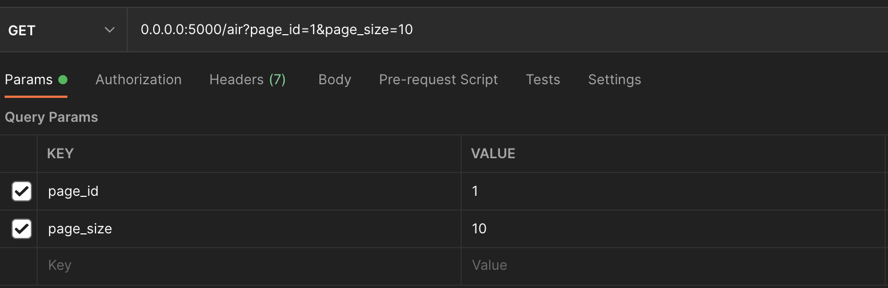

# Инструкция

1. Создать сеть spd-network

```bash
make network
```

2. Создать образ

```bash
make image
```

3. Запуск

```bash
docker compose up
```

# Примеры запросов

## Перечень загрязняющих веществ, подлежащих обязательному замеру в пробах атмосферного воздуха

1. ### GET 0.0.0.0:5000/air/`id`

   ---

2. ### POST 0.0.0.0:5000/air

   ```json
   {
       "substanse_name": "second substance",
       "date_of_sampling": "qwe32",
       "number_of_sample": "qwe23",
       "concentration": 1.3,
       "unit_of_measure": "qwe12",
       "location": "qwe12",
       "longitude": "qwe12",
       "latitude": "qwe12",
       "license_area": "qwe12",
       "num_of_license": "qwe12",
       "company": "my company",
       "method_of_determ": "biological",
       "laboratory": "lab1"
    }
   ```

   ---

3. ### Get list 0.0.0.0:5000/air?page_id=1&page_size=10

   query params

   

    ---

4. ### DELETE 0.0.0.0:5000/air/`id`

    ---

5. ### PUT 0.0.0.0:5000/air

    Меняем только название вещества

   ```json
    {
       "id":2,
       "substanse_name": "changed substance"
    }
   ```

---

## Перечень загрязняющих веществ и параметров, подлежащих обязательному исследованию в пробах снежного покрова

1. ### GET 0.0.0.0:5000/snow/`id`

   ---

2. ### POST 0.0.0.0:5000/snow

   ```json
   {
       "substanse_name": "second substance",
       "date_of_sampling": "qwe32",
       "number_of_sample": "qwe23",
       "concentration": 1.3,
       "unit_of_measure": "qwe12",
       "location": "qwe12",
       "longitude": "qwe12",
       "latitude": "qwe12",
       "source_of_emission": "earth",
       "license_area": "qwe12",
       "num_of_license": "qwe12",
       "company": "my company",
       "method_of_determ": "biological",
       "laboratory": "lab1"
    }
   ```

   ---

3. ### Get list 0.0.0.0:5000/snow?page_id=1&page_size=10

   query params

   

    ---

4. ### DELETE 0.0.0.0:5000/snow/`id`

    ---

5. ### PUT 0.0.0.0:5000/snow

    Меняем только название вещества

   ```json
    {
       "id":2,
       "substanse_name": "changed substance"
    }
   ```

---

## Перечень загрязняющих веществ и параметров, подлежащих обязательному исследованию в пробах поверхностных вод

1. ### GET 0.0.0.0:5000/sur-wat/`id`

   ---

2. ### POST 0.0.0.0:5000/sur-wat

    ```json
   {
       "substanse_name": "second substance",
       "date_of_sampling": "qwe32",
       "number_of_sample": "qwe23",
       "concentration": 1.3,
       "unit_of_measure": "qwe12",
       "location": "qwe12",
       "longitude": "qwe12",
       "latitude": "qwe12",
       "reservoir": "reservoir num 2",
       "license_area": "qwe12",
       "num_of_license": "qwe12",
       "company": "my company",
       "method_of_determ": "biological",
       "laboratory": "lab1"
    }
   ```

3. ### Get list 0.0.0.0:5000/sur-wat?page_id=1&page_size=10

   query params

   

    ---

4. ### DELETE 0.0.0.0:5000/sur-wat/`id`

    ---

5. ### PUT 0.0.0.0:5000/sur-wat

    Меняем только название вещества

   ```json
    {
       "id":2,
       "substanse_name": "changed substance"
    }
   ```

---

## Перечень загрязняющих веществ и параметров, подлежащих обязательному исследованию в пробах донных отложений

1. ### GET 0.0.0.0:5000/bot-sed/`id`

   ---

2. ### POST 0.0.0.0:5000/bot-sed

    ```json
   {
       "substanse_name": "second substance",
       "date_of_sampling": "qwe32",
       "number_of_sample": "qwe23",
       "type_of_sediments": "bottom sediment",
       "concentration": 1.3,
       "unit_of_measure": "qwe12",
       "location": "qwe12",
       "longitude": "qwe12",
       "latitude": "qwe12",
       "reservoir": "reservoir of sediment",
       "license_area": "qwe12",
       "num_of_license": "qwe12",
       "company": "my company",
       "method_of_determ": "biological",
       "laboratory": "lab1"
    }
   ```

3. ### Get list 0.0.0.0:5000/bot-sed?page_id=1&page_size=10

   query params

   

    ---

4. ### DELETE 0.0.0.0:5000/bot-sed/`id`

    ---

5. ### PUT 0.0.0.0:5000/bot-sed

    Меняем только название вещества

   ```json
    {
       "id":2,
       "substanse_name": "changed substance"
    }
   ```

---

## Перечень загрязняющих веществ и параметров, подлежащих обязательному исследованию в пробах почв

1. ### GET 0.0.0.0:5000/soil/`id`

   ---

2. ### POST 0.0.0.0:5000/soil

   ```json
   {
       "substanse_name": "second substance",
       "date_of_sampling": "qwe32",
       "number_of_sample": "qwe23",
       "soil_subtype": "Soil subtype",
       "concentration": 1.3,
       "unit_of_measure": "qwe12",
       "location": "qwe12",
       "longitude": "qwe12",
       "latitude": "qwe12",
       "license_area": "qwe12",
       "num_of_license": "qwe12",
       "company": "my company",
       "method_of_determ": "biological",
       "laboratory": "lab1"
    }
   ```

   ---

3. ### Get list 0.0.0.0:5000/soil?page_id=1&page_size=10

   query params

   

    ---

4. ### DELETE 0.0.0.0:5000/soil/`id`

    ---

5. ### PUT 0.0.0.0:5000/soil

    Меняем только название вещества

   ```json
    {
       "id":2,
       "substanse_name": "changed substance"
    }
   ```
